# PRD - Sistema CRM/SAAS REMAX IRON
## Product Requirements Document - Versión Detallada para Implementación

**Cliente:** Diego González - REMAX IRON
**Fecha:** Noviembre 2025
**Versión:** 2.0 - Post Feedback Meeting
**Stack Tecnológico:** React, Node.js, Supabase, Tailwind CSS, WhatsApp API
**Equipo:** Javier Cabrera, José Andonaire

---

## TABLA DE CONTENIDOS

1. [Resumen Ejecutivo](#1-resumen-ejecutivo)
2. [Puntos Críticos del Cliente](#2-puntos-críticos-del-cliente)
3. [Arquitectura del Sistema](#3-arquitectura-del-sistema)
4. [Stack Tecnológico Detallado](#4-stack-tecnológico-detallado)
5. [Módulo de Infraestructura](#5-módulo-de-infraestructura)
6. [Módulo de Reclutamiento](#6-módulo-de-reclutamiento)
7. [Módulo de Captación](#7-módulo-de-captación)
8. [Módulo de Venta](#8-módulo-de-venta)
9. [Sistema de IA y Agentes](#9-sistema-de-ia-y-agentes)
10. [Integraciones](#10-integraciones)
11. [Esquema de Base de Datos](#11-esquema-de-base-de-datos)
12. [Plan de Implementación](#12-plan-de-implementación)

---

## 1. RESUMEN EJECUTIVO

### 1.1 Visión del Producto

Sistema CRM/SAAS modular que automatiza los tres flujos de negocio de REMAX IRON:
- **Reclutamiento**: Convertir interesados en agentes inmobiliarios activos
- **Captación**: Conseguir propiedades para vender
- **Venta**: Conectar compradores con propiedades

### 1.2 Propuesta de Valor

**Para Diego González:** Un sistema que libera a sus agentes del trabajo operativo, permitiéndoles enfocarse 100% en relaciones personales y cierre de negocios.

**Metáfora Clave:** Los agentes son "rockstars" y el sistema es el manager que les llena la agenda de conciertos.

### 1.3 Objetivos Clave

1. ✅ Centralizar TODOS los leads en una base de datos única
2. ✅ Automatizar seguimiento y calificación de leads
3. ✅ Usar IA para conversaciones inteligentes y naturales
4. ✅ Mantener UN SOLO número de WhatsApp para toda la operación
5. ✅ Permitir al cliente ajustar prompts y configuraciones
6. ✅ Actualizar CRM en tiempo real cuando entra un lead
7. ✅ Gestionar agenda de 35+ agentes de forma inteligente

---

## 2. PUNTOS CRÍTICOS DEL CLIENTE

### 2.1 Requisitos No Negociables (Del Feedback de Diego)

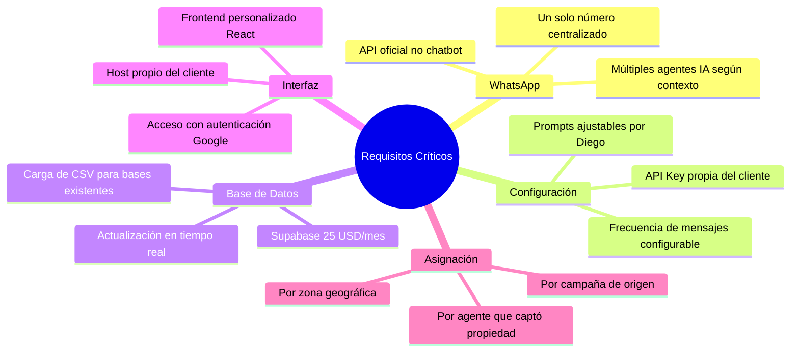

### 2.2 Clarificaciones Importantes

#### 2.2.1 Sobre WhatsApp e IA

**Lo que Diego entendió:**
- ✅ UN SOLO número de WhatsApp para todo (no 35 números)
- ✅ IA conversacional (no chatbot de botones)
- ✅ Múltiples "agentes" de IA (no múltiples números)
- ✅ Conversaciones fluidas y naturales
- ✅ Capacidad de consultar base de datos de propiedades

**Diferencias vs Chatbot:**
```
Chatbot ManyChat:
├─ Botones y opciones fijas
├─ Flujos rígidos paso a paso
├─ No puede responder preguntas abiertas
└─ Límite de conversaciones (1000/mes)

IA con Agentes:
├─ Conversación natural en lenguaje coloquial
├─ Responde preguntas abiertas inteligentemente
├─ Consulta base de datos para respuestas dinámicas
├─ Extrae información de conversaciones no estructuradas
└─ Ilimitado (solo paga por tokens)
```

#### 2.2.2 Sobre Configuración de Prompts

**Requisito de Diego:**
- Poder ajustar el tono: más maternal, más enfocado en dinero, más amable, etc.
- Modificar según resultados: "Con mujeres mayores de 30, pregunta primero por sus hijos"
- Proceso iterativo de mejora continua

**Solución Propuesta:**
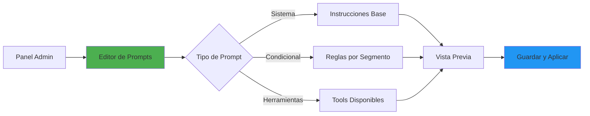

**Implementación:**
- Panel visual en frontend para editar prompts
- Prompts almacenados en tabla `ai_configurations`
- Sistema de versiones para rollback si algo falla
- Testing sandbox antes de aplicar a producción

#### 2.2.3 Sobre API Keys y Ownership

**Preocupación de Diego:**
> "Si ustedes manejan el agente en su cuenta, cuando terminemos el contrato pierdo todo el entrenamiento del agente"

**Clarificación Técnica:**
- ❌ No existe "entrenamiento" persistente en el modelo
- ✅ El "conocimiento" está en los PROMPTS (código)
- ✅ Los prompts se almacenan en la base de datos del cliente
- ✅ El API Key es solo una "tarjeta de crédito" para pagar tokens

**Configuración Recomendada:**
1. Cliente crea su propia cuenta OpenAI/Anthropic
2. Cliente obtiene su API Key
3. Cliente ingresa API Key en el sistema (encriptada)
4. Sistema usa API Key del cliente para todas las llamadas
5. Cliente recibe facturas directamente de OpenAI/Anthropic
6. Cliente puede cambiar API Key cuando quiera

**Ventajas:**
- ✅ Total transparencia de costos
- ✅ Control total del cliente
- ✅ No hay dependencia del proveedor
- ✅ Cliente ve exactamente cuánto gasta en IA

#### 2.2.4 Sobre Correos Electrónicos

**Lo que Diego preguntó:**
> "¿Los correos se mandan desde esta interfaz o necesito MailChimp?"

**Respuesta:**
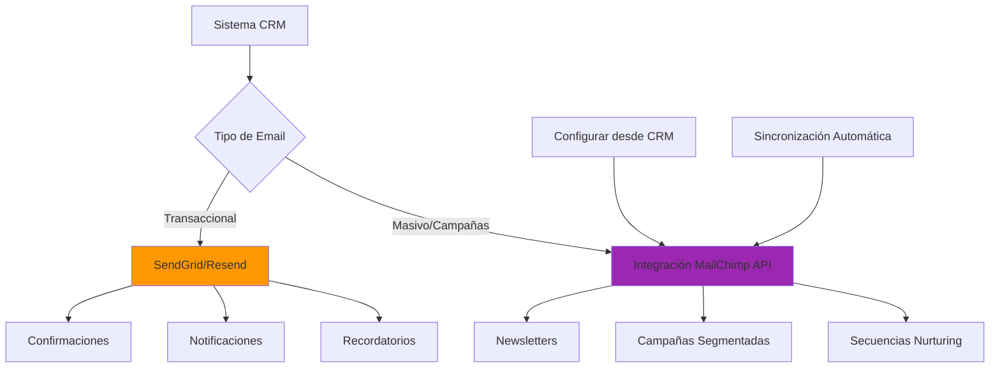

**Implementación:**
1. **Emails Transaccionales (Nativo):**
   - Confirmaciones de cita
   - Recordatorios de reunión
   - Notificaciones a agentes
   - Usa SendGrid API directamente

2. **Emails Masivos (MailChimp):**
   - Sistema exporta audiencias a MailChimp vía API
   - Diego configura campañas en MailChimp
   - O configura templates en el CRM que se ejecutan vía MailChimp API

**Módulo de Email en CRM:**
```typescript
interface EmailCampaign {
  id: string
  name: string
  type: 'transactional' | 'bulk'
  provider: 'sendgrid' | 'mailchimp'
  audience_filter: AudienceFilter
  template_id: string
  schedule: {
    frequency: 'once' | 'daily' | 'weekly' | 'monthly'
    send_at?: Date
    days_delay?: number
  }
  status: 'draft' | 'active' | 'paused'
}
```

---

## 3. ARQUITECTURA DEL SISTEMA

### 3.1 Vista de Alto Nivel

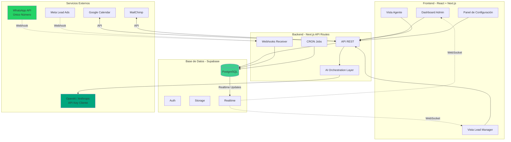

### 3.2 Arquitectura de Datos

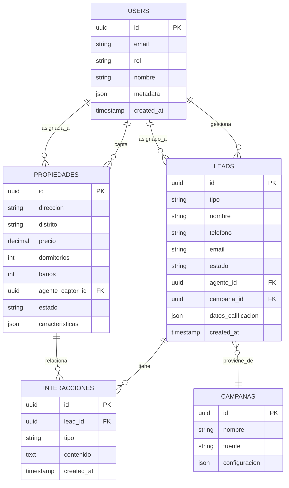

### 3.3 Flujo de un Lead desde Entrada hasta Conversión

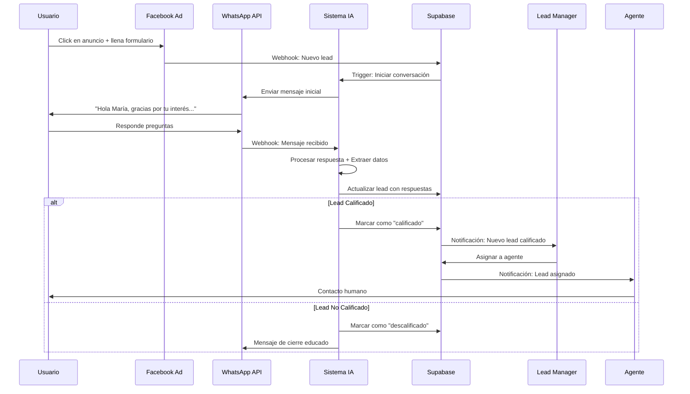

---

## 4. STACK TECNOLÓGICO DETALLADO

### 4.1 Frontend

```typescript
// Stack Frontend
{
  framework: "Next.js 14 (App Router)",
  ui: "React 18",
  styling: "Tailwind CSS v3",
  components: "shadcn/ui + Radix UI",
  stateManagement: "Zustand + React Query",
  forms: "React Hook Form + Zod",
  charts: "Recharts",
  calendar: "react-big-calendar",
  realtime: "Supabase Realtime subscriptions"
}
```

**Estructura de Carpetas:**
```
src/
├── app/                    # Next.js App Router
│   ├── (auth)/            # Rutas autenticadas
│   │   ├── dashboard/     # Dashboard principal
│   │   ├── leads/         # Gestión de leads
│   │   ├── propiedades/   # Gestión de propiedades
│   │   ├── agentes/       # Gestión de agentes
│   │   ├── configuracion/ # Panel de configuración
│   │   └── reportes/      # Reportes y analytics
│   ├── api/               # API Routes
│   └── login/             # Página de login
├── components/
│   ├── ui/                # Componentes base (shadcn)
│   ├── forms/             # Formularios reutilizables
│   ├── tables/            # Tablas de datos
│   ├── modals/            # Modales
│   └── charts/            # Gráficas
├── lib/
│   ├── supabase/          # Cliente Supabase
│   ├── ai/                # Funciones de IA
│   └── utils/             # Utilidades
└── types/                 # TypeScript types
```

### 4.2 Backend

```typescript
// Stack Backend
{
  runtime: "Node.js 20 LTS",
  framework: "Next.js API Routes",
  database: "Supabase (PostgreSQL 15)",
  orm: "Prisma ORM",
  auth: "Supabase Auth + Google OAuth",
  fileStorage: "Supabase Storage",
  apiValidation: "Zod",
  scheduling: "node-cron"
}
```

**API Routes Principales:**
```
/api/
├── leads/
│   ├── create              # POST: Crear lead
│   ├── [id]               # GET/PATCH: Lead específico
│   ├── assign             # POST: Asignar a agente
│   └── bulk-import        # POST: Importar CSV
├── propiedades/
│   ├── create             # POST: Crear propiedad
│   ├── [id]               # GET/PATCH: Propiedad específica
│   └── match              # POST: Buscar matches
├── webhooks/
│   ├── whatsapp           # POST: Webhook WhatsApp
│   ├── facebook           # POST: Webhook Facebook
│   └── mailchimp          # POST: Webhook MailChimp
├── ai/
│   ├── chat               # POST: Procesar mensaje
│   ├── prompts            # GET/PATCH: Gestionar prompts
│   └── agents             # GET: Lista de agentes IA
├── calendar/
│   ├── availability       # GET: Disponibilidad
│   └── book               # POST: Agendar cita
└── integrations/
    ├── mailchimp/sync     # POST: Sincronizar con MailChimp
    └── google-calendar    # POST: Sincronizar con Google
```

### 4.3 Base de Datos - Supabase

**Configuración:**
```javascript
// supabase.config.js
{
  plan: "Pro ($25/month)",
  region: "us-east-1",
  database: {
    size: "Small (2GB RAM)",
    connections: "60 concurrent",
    backups: "Daily automated (7 days retention)"
  },
  storage: {
    limit: "100GB",
    cdn: "Enabled"
  },
  auth: {
    providers: ["Google"],
    jwtExpiry: "1 hour",
    refreshToken: "30 days"
  },
  realtime: {
    enabled: true,
    maxConnections: 500
  }
}
```

### 4.4 Servicios Externos

#### WhatsApp Business API

**Proveedor Recomendado:** Como.io o alternativa similar

```javascript
// whatsapp.config.js
{
  provider: "Como.io",
  cost: "$25/month por número",
  phoneNumber: "+51 XXX XXX XXX", // UN SOLO NÚMERO
  features: [
    "API oficial de WhatsApp",
    "Webhooks bidireccionales",
    "Envío de mensajes con plantillas",
    "Envío de mensajes de sesión",
    "Media (imágenes, PDFs)",
    "Botones de respuesta rápida"
  ],
  limits: {
    messagesPerDay: "Sin límite oficial",
    recommended: "~1000 mensajes/día para evitar flags"
  }
}
```

**Flujo de Mensajería:**
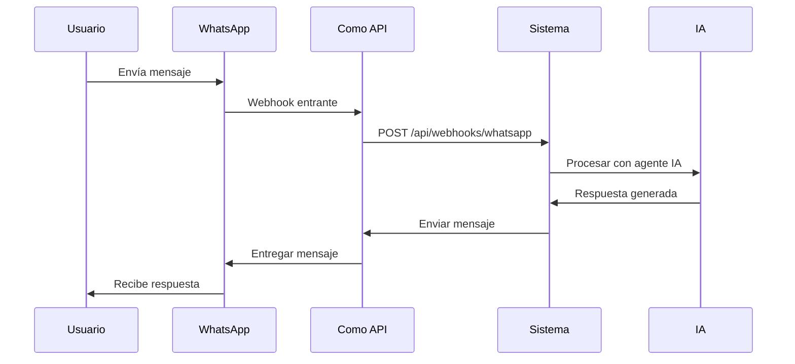

#### OpenAI / Anthropic API

**Configuración Cliente:**
```typescript
interface AIConfiguration {
  provider: 'openai' | 'anthropic'
  apiKey: string // Encriptado en DB
  models: {
    primary: 'gpt-4-turbo' | 'claude-3-opus'
    fallback: 'gpt-3.5-turbo' | 'claude-3-sonnet'
  }
  costs: {
    estimatedMonthly: number // Calculado
    currentMonth: number // Tracking en tiempo real
  }
  limits: {
    maxTokensPerMessage: 4000
    maxDailySpend: 100 // USD
  }
}
```

**Múltiples Agentes de IA:**
```typescript
const aiAgents = {
  // Agente 1: Calificación con datos de formulario
  qualifier_with_data: {
    model: 'gpt-4-turbo',
    systemPrompt: `Eres un asistente de REMAX que califica leads.
    Tienes acceso a los siguientes datos del formulario: {formData}
    Tu trabajo es confirmar la información y agendar una cita.`,
    tools: ['schedule_appointment', 'update_lead_status'],
    temperature: 0.7
  },

  // Agente 2: Calificación sin datos (WhatsApp directo)
  qualifier_cold: {
    model: 'gpt-4-turbo',
    systemPrompt: `Eres un asistente de REMAX que recibe consultas por WhatsApp.
    No tienes información previa. Debes preguntar de forma natural:
    - Nombre
    - Qué está buscando (comprar/vender/trabajar)
    - Datos de contacto adicionales`,
    tools: ['create_lead', 'qualify_interest'],
    temperature: 0.8
  },

  // Agente 3: Consultas sobre propiedades
  property_advisor: {
    model: 'gpt-4-turbo',
    systemPrompt: `Eres un asesor inmobiliario experto.
    Tienes acceso a la base de datos de propiedades disponibles.
    Responde preguntas sobre propiedades, características, precios, ubicación.`,
    tools: ['search_properties', 'get_property_details', 'suggest_alternatives'],
    temperature: 0.6
  },

  // Agente 4: Seguimiento y recordatorios
  follow_up: {
    model: 'gpt-3.5-turbo', // Más económico
    systemPrompt: `Eres un asistente que envía recordatorios amables.
    Mantén un tono cordial y breve.`,
    tools: ['send_reminder'],
    temperature: 0.5
  }
}
```

---

## 5. MÓDULO DE INFRAESTRUCTURA

### 5.1 Descripción

Base tecnológica que soporta los 3 módulos principales. NO incluye automatizaciones, solo la arquitectura.

### 5.2 Componentes de Infraestructura

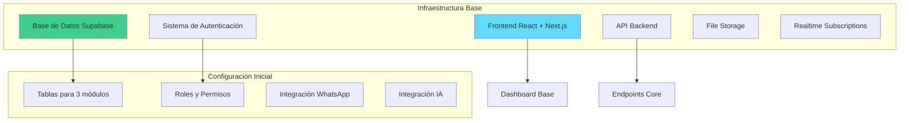

### 5.3 Entregables de Infraestructura

1. **Base de Datos Configurada:**
   - Todas las tablas creadas (vacías)
   - Relaciones establecidas
   - Índices optimizados
   - Row Level Security configurado

2. **Frontend Base:**
   - Sistema de autenticación con Google
   - Layout principal con navegación
   - Dashboard vacío pero funcional
   - Sistema de notificaciones

3. **API Core:**
   - CRUD básico para leads, propiedades, agentes
   - Webhooks receivers configurados
   - Sistema de logging

4. **Integraciones Base:**
   - WhatsApp API conectado y probado
   - API de IA configurado con cuenta del cliente
   - Google Calendar API conectado

### 5.4 Panel de Configuración

**Vista de Configuración General:**

```typescript
interface SystemConfiguration {
  // Configuración de IA
  ai: {
    provider: 'openai' | 'anthropic'
    apiKey: string
    defaultModel: string
    maxTokens: number
    temperature: number
  }

  // Configuración de WhatsApp
  whatsapp: {
    phoneNumber: string
    apiKey: string
    webhookUrl: string
    businessHours: {
      start: string // "09:00"
      end: string   // "18:00"
    }
    autoResponseOutsideHours: boolean
  }

  // Configuración de Email
  email: {
    provider: 'sendgrid' | 'resend'
    apiKey: string
    fromEmail: string
    fromName: string
    mailchimp?: {
      apiKey: string
      listId: string
    }
  }

  // Configuración de Calendario
  calendar: {
    googleServiceAccount: string
    defaultDuration: number // minutos
    bufferTime: number // minutos entre citas
  }
}
```

**Interfaz de Usuario:**
```tsx
// Componente ConfigurationPanel
<Tabs>
  <TabList>
    <Tab>General</Tab>
    <Tab>Inteligencia Artificial</Tab>
    <Tab>WhatsApp</Tab>
    <Tab>Email</Tab>
    <Tab>Calendario</Tab>
    <Tab>Usuarios y Permisos</Tab>
  </TabList>

  <TabPanel name="Inteligencia Artificial">
    <Form>
      <Select label="Proveedor de IA">
        <Option value="openai">OpenAI (GPT-4)</Option>
        <Option value="anthropic">Anthropic (Claude)</Option>
      </Select>

      <Input
        label="API Key"
        type="password"
        helperText="Tu API Key personal. Se encripta en la base de datos."
      />

      <CostEstimator />

      <Button onClick={testConnection}>
        Probar Conexión
      </Button>
    </Form>
  </TabPanel>
</Tabs>
```

---

## 6. MÓDULO DE RECLUTAMIENTO

### 6.1 Flujo Completo

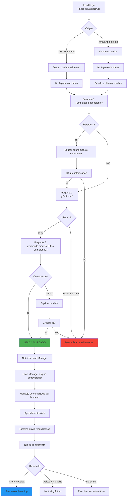

### 6.2 Configuración de Prompts para Reclutamiento

**Prompt Sistema - Agente con Datos de Formulario:**
```markdown
# IDENTIDAD
Eres María, asistente de reclutamiento de REMAX IRON.
Tu tono es amable, profesional y empático.

# CONTEXTO
El lead {nombre} llenó un formulario expresando interés en trabajar como agente inmobiliario.
Ya tienes estos datos: {datos_formulario}

# OBJETIVO
Calificar al lead con 3 preguntas clave y agendar una entrevista si califica.

# PREGUNTAS OBLIGATORIAS (en orden):
1. "¿Actualmente trabajas como empleado dependiente?"
   - Si SÍ: Explica que el modelo es 100% por comisiones y pregunta si aún le interesa.
   - Si NO: Continúa a pregunta 2.

2. "¿Te encuentras en la ciudad de Lima?"
   - Si NO: Descalifica amablemente: "Por ahora solo trabajamos en Lima."
   - Si SÍ: Continúa a pregunta 3.

3. "Este no es un empleo fijo, sino un modelo de negocio donde ganas por comisiones. ¿Te queda claro?"
   - Si hay dudas: Explica brevemente y confirma comprensión.
   - Si SÍ entiende: Marca como CALIFICADO.

# REGLAS
- Haz UNA pregunta a la vez
- Espera la respuesta antes de continuar
- Sé natural, no parezcas robot
- Si el lead pregunta algo fuera de tema, responde brevemente y vuelve al flujo
- Si el lead se molesta o quiere hablar con humano, marca para contacto humano urgente

# HERRAMIENTAS DISPONIBLES
- update_lead_status(status: string)
- notify_lead_manager(message: string)
- schedule_interview(date: string, time: string)

# EJEMPLO DE CONVERSACIÓN
Lead: "Hola, me interesa"
María: "¡Hola {nombre}! Qué bueno que te interese. Para conocerte mejor, ¿actualmente trabajas como empleado dependiente?"
Lead: "No, estoy independiente"
María: "Perfecto. ¿Te encuentras en Lima?"
Lead: "Sí, en San Miguel"
María: "Genial. Una última pregunta importante: en REMAX trabajamos 100% por comisiones, no hay sueldo fijo. ¿Te queda claro este modelo?"
Lead: "Sí, entiendo"
María: "Excelente {nombre}. Un asesor de nuestro equipo te contactará hoy mismo para coordinar una charla informativa. ¡Bienvenido al equipo! 🎉"
```

**Prompt Sistema - Agente sin Datos (WhatsApp Directo):**
```markdown
# IDENTIDAD
Eres María, asistente de REMAX IRON.

# CONTEXTO
Esta persona te escribió directamente por WhatsApp sin llenar formulario.
No tienes ningún dato previo.

# OBJETIVO
1. Obtener nombre y confirmar interés
2. Ejecutar las 3 preguntas de calificación
3. Obtener email para seguimiento

# FLUJO
1. Saluda y pregunta cómo te puedes dirigir a la persona
2. Confirma qué le interesa: ¿trabajar, comprar o vender?
3. Si es trabajar: Ejecuta el flujo de calificación
4. Obtén email antes de finalizar

# EJEMPLO
María: "¡Hola! Gracias por escribirnos. ¿Cómo te llamas?"
Lead: "Soy Carla"
María: "Mucho gusto Carla. ¿En qué te podemos ayudar? ¿Te interesa trabajar como agente inmobiliaria, comprar o vender una propiedad?"
Lead: "Trabajar"
María: "Perfecto. Déjame hacerte algunas preguntas rápidas..."
[Continúa con las 3 preguntas de calificación]
```

### 6.3 Secuencias de Seguimiento Automatizado

```typescript
interface FollowUpSequence {
  name: string
  trigger: string
  messages: FollowUpMessage[]
}

interface FollowUpMessage {
  delay_days: number
  channel: 'whatsapp' | 'email'
  template: string
  condition?: string
}

// Secuencia: Lead calificado pero no agenda entrevista
const sequenceEntrevistaNoAgendada: FollowUpSequence = {
  name: "Seguimiento Entrevista No Agendada",
  trigger: "lead_calificado_sin_cita",
  messages: [
    {
      delay_days: 1,
      channel: 'whatsapp',
      template: `Hola {nombre}, ¿pudiste pensar en fechas para la charla informativa?

Te comparto que tenemos horarios disponibles esta semana. ¿Te gustaría que coordinemos?`
    },
    {
      delay_days: 3,
      channel: 'email',
      template: `Asunto: REMAX - Oportunidad de ser agente inmobiliaria

Hola {nombre},

Notamos que mostraste interés en trabajar con nosotros pero aún no coordinamos una charla.

¿Podemos agendar 30 minutos esta semana? Te compartiré todo sobre:
- Cómo funciona el modelo de comisiones
- Historias de éxito de agentes
- Herramientas y capacitación que ofrecemos

¿Qué día te viene bien?

Saludos,
Equipo REMAX IRON`
    },
    {
      delay_days: 7,
      channel: 'whatsapp',
      template: `{nombre}, última oportunidad para unirte a nuestro próximo grupo de capacitación.

¿Conversamos hoy?`
    }
  ]
}

// Secuencia: Post entrevista - no asistió
const sequenceNoAsistio: FollowUpSequence = {
  name: "Reactivación No Show",
  trigger: "cita_no_show",
  messages: [
    {
      delay_days: 0, // Mismo día
      channel: 'whatsapp',
      template: `Hola {nombre}, notamos que no pudiste asistir a la entrevista de hoy.

¿Todo bien? Si quieres reagendar, avísame.`
    },
    {
      delay_days: 2,
      channel: 'whatsapp',
      template: `{nombre}, ¿te gustaría reagendar para esta semana? Tenemos espacios disponibles.`
    },
    {
      delay_days: 7,
      channel: 'email',
      template: `Asunto: Segunda oportunidad - REMAX

Hola {nombre},

Entendemos que a veces surgen imprevistos.

Si todavía te interesa la oportunidad de trabajar como agente inmobiliaria, podemos coordinar una nueva fecha.

¿Conversamos?`
    }
  ]
}
```

### 6.4 Panel de Gestión de Reclutamiento

**Vista de Lead Manager:**

```tsx
<Dashboard module="reclutamiento">
  <KPICards>
    <KPI
      title="Leads Este Mes"
      value={125}
      trend="+15%"
    />
    <KPI
      title="Calificados"
      value={47}
      percentage={37.6}
    />
    <KPI
      title="Entrevistas Agendadas"
      value={23}
    />
    <KPI
      title="Convertidos a Agentes"
      value={8}
    />
  </KPICards>

  <Pipeline>
    <Stage name="Nuevos" count={45}>
      <LeadCard />
      <LeadCard />
      ...
    </Stage>
    <Stage name="Calificando" count={32} />
    <Stage name="Calificados" count={18} />
    <Stage name="Entrevista Agendada" count={12} />
    <Stage name="Post-Entrevista" count={8} />
    <Stage name="Convertido" count={5} />
  </Pipeline>

  <ActionItems>
    <Alert priority="high">
      15 leads calificados esperan asignación
    </Alert>
    <Alert priority="medium">
      3 entrevistas mañana - enviar recordatorios
    </Alert>
  </ActionItems>
</Dashboard>
```

---

## 7. MÓDULO DE CAPTACIÓN

### 7.1 Flujo Completo

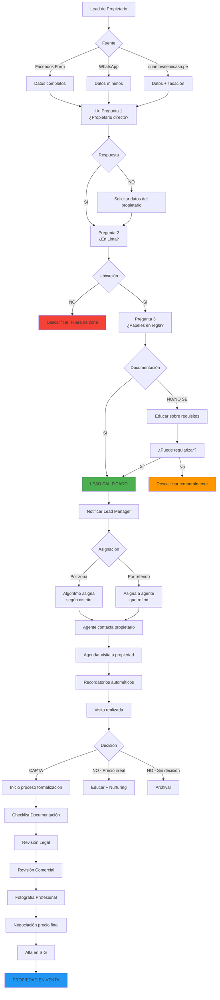

### 7.2 Sistema de Asignación de Agentes

**Lógica de Asignación por Zona:**

```typescript
interface AgentZoneAssignment {
  agent_id: string
  agent_name: string
  zones: string[]  // Distritos
  capacity: number // Máximo de propiedades activas
  current_load: number
  availability: 'available' | 'busy' | 'full'
}

async function assignAgentToCaptacion(lead: Lead): Promise<string> {
  // 1. Prioridad: Si viene por referido, va a ese agente
  if (lead.referred_by_agent_id) {
    return lead.referred_by_agent_id
  }

  // 2. Buscar agentes que cubren la zona
  const agentsInZone = await getAgentsByZone(lead.distrito)

  // 3. Filtrar por disponibilidad
  const availableAgents = agentsInZone.filter(a =>
    a.availability !== 'full' &&
    a.current_load < a.capacity
  )

  if (availableAgents.length === 0) {
    // Notificar al Lead Manager: necesita reasignación manual
    await notifyLeadManager({
      message: `Lead en ${lead.distrito} sin agentes disponibles`,
      lead_id: lead.id,
      requires_action: true
    })
    return null
  }

  // 4. Asignar al agente con menor carga
  const bestAgent = availableAgents.sort((a, b) =>
    a.current_load - b.current_load
  )[0]

  return bestAgent.agent_id
}

// Configuración de zonas por agente (editable desde dashboard)
const zonesConfiguration = {
  "javier_123": {
    zones: ["La Molina", "Ate", "Santa Anita"],
    capacity: 15
  },
  "jose_456": {
    zones: ["San Isidro", "Miraflores", "San Borja"],
    capacity: 12
  },
  "maria_789": {
    zones: ["Surco", "Monterrico", "Chacarilla"],
    capacity: 10
  }
}
```

**Interfaz de Configuración:**

```tsx
<ZoneAssignmentPanel>
  <AgentList>
    {agents.map(agent => (
      <AgentCard key={agent.id}>
        <AgentInfo name={agent.name} />
        <ZoneSelector
          selected={agent.zones}
          onChange={handleZoneChange}
        />
        <CapacitySlider
          value={agent.capacity}
          max={30}
          onChange={handleCapacityChange}
        />
        <CurrentLoad
          current={agent.current_load}
          capacity={agent.capacity}
        />
      </AgentCard>
    ))}
  </AgentList>

  <ZoneMap>
    {/* Mapa visual de Lima con zonas coloreadas por agente */}
  </ZoneMap>
</ZoneAssignmentPanel>
```

### 7.3 Checklist de Formalización

```typescript
interface FormalizationChecklist {
  propiedad_id: string
  items: ChecklistItem[]
  status: 'pending' | 'in_progress' | 'completed'
  blocked_reasons?: string[]
}

interface ChecklistItem {
  id: string
  name: string
  category: 'documentacion' | 'legal' | 'comercial' | 'marketing'
  required: boolean
  completed: boolean
  completed_by?: string
  completed_at?: Date
  notes?: string
}

const defaultChecklist: ChecklistItem[] = [
  // DOCUMENTACIÓN
  {
    id: 'doc_01',
    name: 'Partida registral',
    category: 'documentacion',
    required: true,
    completed: false
  },
  {
    id: 'doc_02',
    name: 'Título de propiedad',
    category: 'documentacion',
    required: true,
    completed: false
  },
  {
    id: 'doc_03',
    name: 'DNI del propietario',
    category: 'documentacion',
    required: true,
    completed: false
  },
  {
    id: 'doc_04',
    name: 'Recibos de servicios (luz, agua)',
    category: 'documentacion',
    required: true,
    completed: false
  },

  // REVISIÓN LEGAL
  {
    id: 'legal_01',
    name: 'Verificar que propietario puede vender legalmente',
    category: 'legal',
    required: true,
    completed: false
  },
  {
    id: 'legal_02',
    name: 'Verificar ausencia de cargas y gravámenes',
    category: 'legal',
    required: true,
    completed: false
  },

  // REVISIÓN COMERCIAL
  {
    id: 'com_01',
    name: 'Validar precio vs. mercado',
    category: 'comercial',
    required: true,
    completed: false
  },
  {
    id: 'com_02',
    name: 'Negociar precio competitivo',
    category: 'comercial',
    required: true,
    completed: false
  },

  // MARKETING
  {
    id: 'mkt_01',
    name: 'Fotografía profesional agendada',
    category: 'marketing',
    required: true,
    completed: false
  },
  {
    id: 'mkt_02',
    name: 'Fotos subidas al sistema',
    category: 'marketing',
    required: true,
    completed: false
  },
  {
    id: 'mkt_03',
    name: 'Descripción comercial redactada',
    category: 'marketing',
    required: false,
    completed: false
  }
]
```

**Vista de Checklist:**

```tsx
<PropertyChecklist propertyId={propId}>
  <Header>
    <PropertyInfo />
    <ProgressBar
      completed={8}
      total={11}
      percentage={72.7}
    />
  </Header>

  <ChecklistSection category="documentacion">
    <SectionTitle>Documentación (4/4 ✓)</SectionTitle>
    {items.map(item => (
      <ChecklistItemRow
        key={item.id}
        item={item}
        onToggle={handleToggle}
        onAddNote={handleAddNote}
      />
    ))}
  </ChecklistSection>

  <ChecklistSection category="legal">
    <SectionTitle>Revisión Legal (1/2)</SectionTitle>
    ...
  </ChecklistSection>

  <Actions>
    <Button
      disabled={!allRequiredCompleted}
      onClick={handleMarkReadyForSIG}
    >
      Marcar Lista para SIG
    </Button>
  </Actions>
</PropertyChecklist>
```

### 7.4 Export a SIG (Sistema REMAX)

```typescript
// Como SIG no tiene API, generamos Excel con formato específico
interface SIGExportFormat {
  // Columnas requeridas por SIG
  'Código Interno': string
  'Tipo': string
  'Dirección': string
  'Distrito': string
  'Precio USD': number
  'Dormitorios': number
  'Baños': number
  'Área Total': number
  'Área Construida': number
  'Descripción': string
  'Agente': string
  'Teléfono Agente': string
  'Estado': string
}

async function generateSIGExport(propertyIds: string[]): Promise<Blob> {
  const properties = await getProperties(propertyIds)

  const sigData: SIGExportFormat[] = properties.map(prop => ({
    'Código Interno': prop.id,
    'Tipo': prop.tipo,
    'Dirección': prop.direccion,
    'Distrito': prop.distrito,
    'Precio USD': prop.precio,
    'Dormitorios': prop.dormitorios,
    'Baños': prop.banos,
    'Área Total': prop.area_total,
    'Área Construida': prop.area_construida,
    'Descripción': prop.descripcion_comercial,
    'Agente': prop.agente.nombre,
    'Teléfono Agente': prop.agente.telefono,
    'Estado': 'EN VENTA'
  }))

  return generateExcelFile(sigData)
}
```

**Interfaz de Export:**

```tsx
<SIGExportPanel>
  <PropertySelector>
    <Filter status="ready_for_sig" />
    <SelectedCount>{selectedProperties.length} propiedades seleccionadas</SelectedCount>
  </PropertySelector>

  <ExportPreview>
    <TablePreview data={previewData} />
  </ExportPreview>

  <Actions>
    <Button onClick={handleGenerateExcel}>
      Generar Excel para SIG
    </Button>
    <Checkbox label="Marcar como 'Publicada en SIG' después de exportar" />
  </Actions>

  <Instructions>
    <h4>Pasos siguientes:</h4>
    <ol>
      <li>Descarga el archivo Excel generado</li>
      <li>Abre el SIG de REMAX</li>
      <li>Ve a Importación masiva</li>
      <li>Sube el archivo</li>
      <li>Verifica que todas las propiedades se importaron correctamente</li>
    </ol>
  </Instructions>
</SIGExportPanel>
```

---

## 8. MÓDULO DE VENTA

### 8.1 Flujo Completo con Sistema Match

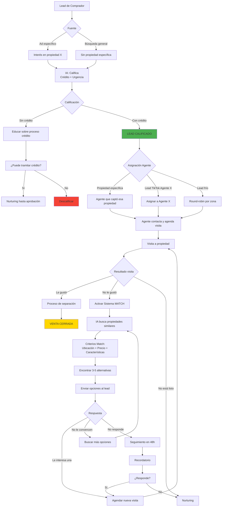

### 8.2 Sistema de Match Inteligente

**Algoritmo de Match:**

```typescript
interface PropertyMatchCriteria {
  lead_id: string
  rejected_property_id: string
  rejection_reason?: string
  preferences: {
    distrito: string[]
    precio_min: number
    precio_max: number
    dormitorios: number
    banos?: number
    tipo: 'departamento' | 'casa' | 'terreno'
    caracteristicas_deseadas?: string[]
  }
}

interface PropertyMatchResult {
  property_id: string
  score: number // 0-100
  match_reasons: string[]
  property: Property
}

async function findPropertyMatches(
  criteria: PropertyMatchCriteria,
  limit: number = 5
): Promise<PropertyMatchResult[]> {

  const query = supabase
    .from('propiedades')
    .select('*')
    .eq('estado', 'en_venta')
    .neq('id', criteria.rejected_property_id)

  // Filtro 1: Ubicación (factor más importante según Diego)
  const preferredDistricts = criteria.preferences.distrito
  const nearbyDistricts = getAdjacentDistricts(preferredDistricts)
  const allDistricts = [...preferredDistricts, ...nearbyDistricts]

  query.in('distrito', allDistricts)

  // Filtro 2: Rango de precio (±20%)
  const priceRange = {
    min: criteria.preferences.precio_min * 0.8,
    max: criteria.preferences.precio_max * 1.2
  }
  query.gte('precio', priceRange.min)
  query.lte('precio', priceRange.max)

  // Filtro 3: Características exactas
  query.eq('dormitorios', criteria.preferences.dormitorios)
  query.eq('tipo', criteria.preferences.tipo)

  const { data: properties } = await query

  // Scoring de resultados
  const scoredProperties = properties.map(prop => {
    let score = 0
    const reasons: string[] = []

    // Puntos por ubicación
    if (preferredDistricts.includes(prop.distrito)) {
      score += 40
      reasons.push(`En ${prop.distrito}, tu distrito preferido`)
    } else {
      score += 20
      reasons.push(`En ${prop.distrito}, zona cercana`)
    }

    // Puntos por precio
    const priceDiff = Math.abs(prop.precio - criteria.preferences.precio_max)
    const priceScore = Math.max(0, 30 - (priceDiff / 10000))
    score += priceScore
    if (prop.precio < criteria.preferences.precio_max) {
      reasons.push(`Precio más accesible: $${prop.precio}K`)
    }

    // Puntos por características especiales
    if (criteria.preferences.caracteristicas_deseadas) {
      const matchedFeatures = prop.caracteristicas_especiales.filter(feat =>
        criteria.preferences.caracteristicas_deseadas.includes(feat)
      )
      score += matchedFeatures.length * 10
      if (matchedFeatures.length > 0) {
        reasons.push(`Tiene: ${matchedFeatures.join(', ')}`)
      }
    }

    return {
      property_id: prop.id,
      score,
      match_reasons: reasons,
      property: prop
    }
  })

  // Ordenar por score y retornar top N
  return scoredProperties
    .sort((a, b) => b.score - a.score)
    .slice(0, limit)
}

// Función auxiliar: distritos adyacentes
function getAdjacentDistricts(districts: string[]): string[] {
  const adjacencyMap = {
    'Surco': ['San Borja', 'La Molina', 'Miraflores', 'Barranco'],
    'San Isidro': ['Miraflores', 'Lince', 'Jesús María', 'San Borja'],
    'Miraflores': ['San Isidro', 'Surco', 'Barranco', 'San Borja'],
    'San Borja': ['Surco', 'San Isidro', 'La Molina'],
    'La Molina': ['Surco', 'San Borja', 'Ate'],
    // ... más distritos
  }

  const adjacent = new Set<string>()
  districts.forEach(dist => {
    adjacencyMap[dist]?.forEach(adj => adjacent.add(adj))
  })

  return Array.from(adjacent)
}
```

**Mensaje Automático de Match:**

```typescript
async function sendMatchSuggestions(
  lead: Lead,
  matches: PropertyMatchResult[]
): Promise<void> {

  const message = `Hola ${lead.nombre},

Entiendo que la propiedad anterior no era exactamente lo que buscabas.

He encontrado ${matches.length} opciones que podrían interesarte más:

${matches.map((m, i) => `
${i + 1}. ${m.property.tipo} en ${m.property.distrito}
   💰 $${m.property.precio}K | 🛏️ ${m.property.dormitorios} dorm | 🚿 ${m.property.banos} baños
   ✨ ${m.match_reasons.join(' • ')}
   🔗 Ver fotos: ${getPropertyLink(m.property_id)}
`).join('\n')}

¿Cuál te gustaría conocer? Puedo coordinar visitas para esta semana.`

  await sendWhatsAppMessage(lead.telefono, message)

  // Registrar interacción
  await createInteraction({
    lead_id: lead.id,
    type: 'match_suggestion',
    content: message,
    properties_suggested: matches.map(m => m.property_id)
  })
}
```

### 8.3 Gestión de Calendario Multi-Agente

**Sistema de Disponibilidad:**

```typescript
interface AgentAvailability {
  agent_id: string
  google_calendar_id: string
  working_hours: {
    monday: TimeSlot[]
    tuesday: TimeSlot[]
    wednesday: TimeSlot[]
    thursday: TimeSlot[]
    friday: TimeSlot[]
    saturday: TimeSlot[]
    sunday: TimeSlot[]
  }
  buffer_time: number // minutos entre citas
  max_daily_appointments: number
}

interface TimeSlot {
  start: string // "09:00"
  end: string   // "18:00"
}

interface AvailabilityQuery {
  agent_id?: string // Si ya está asignado
  date_range: {
    start: Date
    end: Date
  }
  duration: number // minutos
  district?: string // Para filtrar agentes por zona
}

async function getAvailableSlots(
  query: AvailabilityQuery
): Promise<AvailableSlot[]> {

  let agents: string[]

  if (query.agent_id) {
    // Si ya tiene agente asignado, solo buscar su disponibilidad
    agents = [query.agent_id]
  } else if (query.district) {
    // Si no, buscar agentes que cubren esa zona
    agents = await getAgentsByZone(query.district)
  } else {
    // Todos los agentes
    agents = await getAllAgentIds()
  }

  const allSlots: AvailableSlot[] = []

  for (const agentId of agents) {
    const agentConfig = await getAgentAvailability(agentId)
    const busyTimes = await getGoogleCalendarBusyTimes(
      agentConfig.google_calendar_id,
      query.date_range
    )

    // Generar slots disponibles
    const slots = generateAvailableSlots(
      agentConfig.working_hours,
      busyTimes,
      query.duration,
      agentConfig.buffer_time
    )

    allSlots.push(...slots.map(slot => ({
      ...slot,
      agent_id: agentId,
      agent_name: agentConfig.name
    })))
  }

  return allSlots.sort((a, b) =>
    a.start.getTime() - b.start.getTime()
  )
}
```

**Widget de Agendamiento:**

```tsx
<AppointmentScheduler lead={lead} property={property}>
  <PropertyInfo property={property} />

  <AgentSelection>
    {assignedAgent ? (
      <AssignedAgentCard agent={assignedAgent} />
    ) : (
      <AgentSelector
        district={property.distrito}
        onSelect={handleAgentSelect}
      />
    )}
  </AgentSelection>

  <CalendarView mode="week">
    <AvailabilityGrid>
      {availableSlots.map(slot => (
        <TimeSlotButton
          key={slot.id}
          time={slot.start}
          agent={slot.agent_name}
          onClick={() => handleBookSlot(slot)}
        >
          {formatTime(slot.start)}
        </TimeSlotButton>
      ))}
    </AvailabilityGrid>
  </CalendarView>

  <SelectedSlot>
    {selectedSlot && (
      <>
        <SlotInfo slot={selectedSlot} />
        <Button onClick={handleConfirmAppointment}>
          Confirmar Cita
        </Button>
      </>
    )}
  </SelectedSlot>
</AppointmentScheduler>
```

**Integración con Google Calendar:**

```typescript
// Usando Google Calendar API
import { google } from 'googleapis'

async function bookAppointmentInGoogleCalendar(
  appointment: Appointment
): Promise<string> {

  const calendar = google.calendar('v3')
  const agent = await getAgent(appointment.agent_id)

  const event = {
    summary: `Visita: ${appointment.property.direccion}`,
    description: `
Cliente: ${appointment.lead.nombre}
Tel: ${appointment.lead.telefono}
Propiedad: ${appointment.property.direccion}
Precio: $${appointment.property.precio}K

Notas: ${appointment.notes || 'N/A'}
    `,
    start: {
      dateTime: appointment.start_time.toISOString(),
      timeZone: 'America/Lima'
    },
    end: {
      dateTime: appointment.end_time.toISOString(),
      timeZone: 'America/Lima'
    },
    attendees: [
      { email: agent.email },
      { email: appointment.lead.email }
    ],
    reminders: {
      useDefault: false,
      overrides: [
        { method: 'email', minutes: 24 * 60 }, // 24h antes
        { method: 'popup', minutes: 120 }       // 2h antes
      ]
    }
  }

  const response = await calendar.events.insert({
    calendarId: agent.google_calendar_id,
    resource: event,
    sendUpdates: 'all' // Enviar invitaciones
  })

  return response.data.id
}
```

### 8.4 Recordatorios Automáticos

```typescript
interface ReminderConfig {
  appointment_id: string
  reminders: Reminder[]
}

interface Reminder {
  timing: 'hours_before' | 'days_before'
  value: number
  channel: 'whatsapp' | 'email' | 'both'
  template: string
  sent: boolean
  sent_at?: Date
}

// CRON job que corre cada hora
async function processReminders() {
  const upcomingAppointments = await getUpcomingAppointments(48) // próximas 48h

  for (const apt of upcomingAppointments) {
    const reminderConfig = await getReminderConfig(apt.id)

    for (const reminder of reminderConfig.reminders) {
      if (reminder.sent) continue

      const shouldSend = checkIfShouldSend(apt.start_time, reminder)

      if (shouldSend) {
        await sendReminder(apt, reminder)
        await markReminderAsSent(reminder.id)
      }
    }
  }
}

// Templates de recordatorios
const reminderTemplates = {
  // 24h antes - Al cliente
  client_24h: `Hola {cliente_nombre},

Te recordamos tu cita para ver la propiedad en {direccion}:

📅 Fecha: {fecha}
⏰ Hora: {hora}
📍 Dirección: {direccion_completa}
👤 Te atenderá: {agente_nombre}

¿Alguna pregunta antes de la visita?`,

  // 2h antes - Al cliente
  client_2h: `{cliente_nombre}, tu visita es en 2 horas:

⏰ {hora} en {direccion}

{agente_nombre} te está esperando. ¿Todo listo?`,

  // 2h antes - Al agente
  agent_2h: `{agente_nombre}, recordatorio de cita:

⏰ Hoy a las {hora}
📍 {direccion}
👤 Cliente: {cliente_nombre}
📞 Tel: {cliente_telefono}

Propiedad: {propiedad_direccion}`
}
```

---

## 9. SISTEMA DE IA Y AGENTES

### 9.1 Arquitectura de Agentes de IA

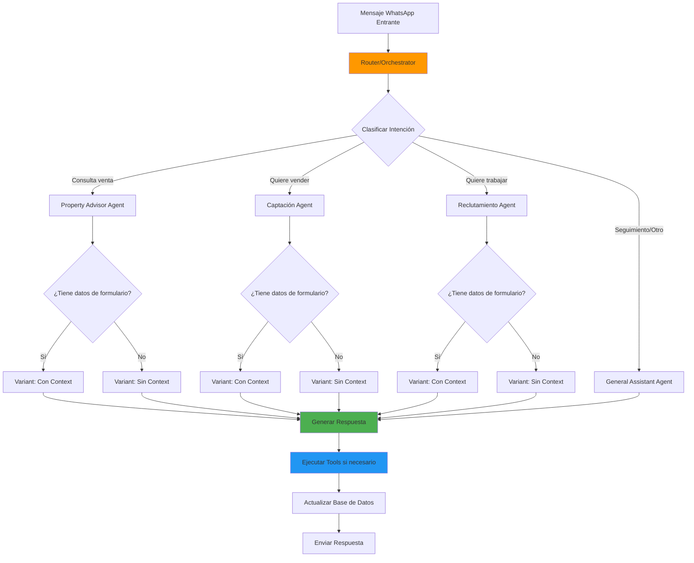

### 9.2 Configuración Detallada de Agentes

```typescript
interface AIAgentConfiguration {
  id: string
  name: string
  description: string
  model: 'gpt-4-turbo' | 'gpt-3.5-turbo' | 'claude-3-opus' | 'claude-3-sonnet'
  system_prompt: string
  tools: AITool[]
  temperature: number
  max_tokens: number
  context_window: number
  fallback_agent?: string
}

// Herramientas disponibles para los agentes
interface AITool {
  name: string
  description: string
  parameters: ToolParameter[]
  implementation: (params: any) => Promise<any>
}

const availableTools: AITool[] = [
  {
    name: 'search_properties',
    description: 'Busca propiedades en la base de datos según criterios',
    parameters: [
      { name: 'distrito', type: 'string', required: false },
      { name: 'precio_max', type: 'number', required: false },
      { name: 'dormitorios', type: 'number', required: false },
      { name: 'tipo', type: 'string', enum: ['departamento', 'casa', 'terreno'] }
    ],
    implementation: async (params) => {
      return await searchPropertiesInDatabase(params)
    }
  },
  {
    name: 'get_property_details',
    description: 'Obtiene detalles completos de una propiedad específica',
    parameters: [
      { name: 'property_id', type: 'string', required: true }
    ],
    implementation: async (params) => {
      return await getPropertyDetails(params.property_id)
    }
  },
  {
    name: 'create_lead',
    description: 'Crea un nuevo lead en el sistema',
    parameters: [
      { name: 'nombre', type: 'string', required: true },
      { name: 'telefono', type: 'string', required: true },
      { name: 'email', type: 'string', required: false },
      { name: 'tipo', type: 'string', enum: ['reclutamiento', 'captacion', 'venta'], required: true }
    ],
    implementation: async (params) => {
      return await createLeadInDatabase(params)
    }
  },
  {
    name: 'update_lead_status',
    description: 'Actualiza el estado de un lead',
    parameters: [
      { name: 'lead_id', type: 'string', required: true },
      { name: 'status', type: 'string', required: true },
      { name: 'notes', type: 'string', required: false }
    ],
    implementation: async (params) => {
      return await updateLeadStatus(params)
    }
  },
  {
    name: 'schedule_appointment',
    description: 'Agenda una cita',
    parameters: [
      { name: 'lead_id', type: 'string', required: true },
      { name: 'date', type: 'string', required: true },
      { name: 'time', type: 'string', required: true },
      { name: 'type', type: 'string', enum: ['visita_propiedad', 'entrevista', 'reunion'] }
    ],
    implementation: async (params) => {
      return await scheduleAppointment(params)
    }
  },
  {
    name: 'notify_lead_manager',
    description: 'Envía una notificación urgente al Lead Manager',
    parameters: [
      { name: 'message', type: 'string', required: true },
      { name: 'priority', type: 'string', enum: ['low', 'medium', 'high', 'urgent'] }
    ],
    implementation: async (params) => {
      return await notifyLeadManager(params)
    }
  },
  {
    name: 'transfer_to_human',
    description: 'Transfiere la conversación a un humano',
    parameters: [
      { name: 'reason', type: 'string', required: true }
    ],
    implementation: async (params) => {
      return await transferToHuman(params)
    }
  }
]
```

### 9.3 Sistema de Router/Orchestrator

```typescript
class AIOrchestrator {

  async processIncomingMessage(message: WhatsAppMessage): Promise<void> {
    // 1. Obtener contexto del lead
    const lead = await this.getOrCreateLead(message.from)
    const conversationHistory = await this.getConversationHistory(lead.id)

    // 2. Clasificar intención
    const intent = await this.classifyIntent(message.text, conversationHistory)

    // 3. Seleccionar agente apropiado
    const agent = this.selectAgent(intent, lead)

    // 4. Construir contexto para el agente
    const context = await this.buildContext(lead, intent)

    // 5. Ejecutar agente
    const response = await this.executeAgent(agent, message.text, context)

    // 6. Procesar respuesta y ejecutar tools si es necesario
    const processedResponse = await this.processAgentResponse(response, lead)

    // 7. Enviar respuesta
    await this.sendResponse(message.from, processedResponse)

    // 8. Guardar interacción
    await this.saveInteraction(lead.id, message.text, processedResponse)
  }

  private async classifyIntent(
    text: string,
    history: Message[]
  ): Promise<IntentType> {
    // Usar un modelo ligero para clasificación rápida
    const classificationPrompt = `
Clasifica la intención del siguiente mensaje en una de estas categorías:
- comprar: Quiere comprar una propiedad
- vender: Quiere vender su propiedad
- trabajar: Quiere trabajar como agente
- consulta: Pregunta sobre una propiedad específica
- seguimiento: Respuesta a mensaje previo
- otro: Cualquier otra cosa

Mensaje: "${text}"

Historial reciente:
${history.slice(-3).map(m => `${m.role}: ${m.content}`).join('\n')}

Responde solo con la categoría.
    `

    const response = await callAIModel({
      model: 'gpt-3.5-turbo', // Rápido y barato para clasificación
      messages: [{ role: 'user', content: classificationPrompt }],
      temperature: 0.3
    })

    return response.content.trim().toLowerCase() as IntentType
  }

  private selectAgent(
    intent: IntentType,
    lead: Lead
  ): AIAgentConfiguration {

    // Lógica de selección de agente
    switch (intent) {
      case 'comprar':
      case 'consulta':
        return lead.has_form_data
          ? agents.property_advisor_with_context
          : agents.property_advisor_cold

      case 'vender':
        return lead.has_form_data
          ? agents.captacion_with_context
          : agents.captacion_cold

      case 'trabajar':
        return lead.has_form_data
          ? agents.reclutamiento_with_context
          : agents.reclutamiento_cold

      case 'seguimiento':
        // Usar el mismo agente que en la última interacción
        return this.getLastUsedAgent(lead.id) || agents.general_assistant

      default:
        return agents.general_assistant
    }
  }

  private async buildContext(
    lead: Lead,
    intent: IntentType
  ): Promise<AgentContext> {
    const context: AgentContext = {
      lead_data: {
        id: lead.id,
        nombre: lead.nombre,
        telefono: lead.telefono,
        email: lead.email,
        tipo: lead.tipo,
        estado: lead.estado,
        created_at: lead.created_at
      },
      conversation_history: await this.getConversationHistory(lead.id),
      relevant_properties: null,
      system_state: {
        current_time: new Date(),
        business_hours: this.isBusinessHours()
      }
    }

    // Si es consulta sobre propiedades, incluir propiedades relevantes
    if (intent === 'comprar' || intent === 'consulta') {
      if (lead.property_preferences) {
        context.relevant_properties = await searchProperties(
          lead.property_preferences
        )
      }
    }

    return context
  }

  private async executeAgent(
    agent: AIAgentConfiguration,
    userMessage: string,
    context: AgentContext
  ): Promise<AgentResponse> {

    // Construir prompt con contexto
    const messages = [
      {
        role: 'system',
        content: this.interpolatePrompt(agent.system_prompt, context)
      },
      ...context.conversation_history.slice(-5), // Últimos 5 mensajes
      {
        role: 'user',
        content: userMessage
      }
    ]

    // Llamar al modelo con tools
    const response = await callAIModel({
      model: agent.model,
      messages,
      tools: agent.tools.map(t => this.formatTool(t)),
      temperature: agent.temperature,
      max_tokens: agent.max_tokens
    })

    return response
  }

  private async processAgentResponse(
    response: AgentResponse,
    lead: Lead
  ): Promise<string> {

    // Si el agente quiere ejecutar herramientas
    if (response.tool_calls) {
      for (const toolCall of response.tool_calls) {
        const tool = availableTools.find(t => t.name === toolCall.name)
        if (tool) {
          await tool.implementation(toolCall.parameters)
        }
      }
    }

    return response.content
  }
}
```

### 9.4 Editor de Prompts (Panel de Configuración)

```tsx
<PromptsConfigurationPanel>
  <AgentSelector>
    {agents.map(agent => (
      <AgentTab
        key={agent.id}
        agent={agent}
        isActive={selectedAgent === agent.id}
        onClick={() => setSelectedAgent(agent.id)}
      />
    ))}
  </AgentSelector>

  <PromptEditor agent={selectedAgent}>
    <EditorHeader>
      <h3>{selectedAgent.name}</h3>
      <Badge>{selectedAgent.model}</Badge>
      <VersionSelector versions={promptVersions} />
    </EditorHeader>

    <SystemPromptTextarea
      value={systemPrompt}
      onChange={handlePromptChange}
      rows={20}
      placeholder="Instrucciones del sistema para el agente..."
    />

    <VariableHelper>
      <h4>Variables disponibles:</h4>
      <VariableList>
        <Variable name="{nombre}" description="Nombre del lead" />
        <Variable name="{telefono}" description="Teléfono del lead" />
        <Variable name="{email}" description="Email del lead" />
        <Variable name="{datos_formulario}" description="Datos del formulario si existen" />
      </VariableList>
    </VariableHelper>

    <ToolsSelector>
      <h4>Herramientas habilitadas:</h4>
      {availableTools.map(tool => (
        <Checkbox
          key={tool.name}
          label={tool.name}
          description={tool.description}
          checked={agent.tools.includes(tool.name)}
          onChange={(checked) => handleToolToggle(tool.name, checked)}
        />
      ))}
    </ToolsSelector>

    <ConfigurationPanel>
      <Slider
        label="Temperature"
        min={0}
        max={1}
        step={0.1}
        value={temperature}
        onChange={setTemperature}
        helperText="0 = respuestas predecibles, 1 = respuestas creativas"
      />
      <Slider
        label="Max Tokens"
        min={500}
        max={4000}
        step={100}
        value={maxTokens}
        onChange={setMaxTokens}
      />
    </ConfigurationPanel>

    <TestingPanel>
      <h4>Probar agente:</h4>
      <Input
        placeholder="Escribe un mensaje de prueba..."
        value={testMessage}
        onChange={setTestMessage}
      />
      <Button onClick={handleTestAgent}>
        Enviar Prueba
      </Button>
      {testResponse && (
        <ResponsePreview>
          {testResponse}
        </ResponsePreview>
      )}
    </TestingPanel>

    <Actions>
      <Button variant="secondary" onClick={handleRevertChanges}>
        Descartar Cambios
      </Button>
      <Button variant="primary" onClick={handleSavePrompt}>
        Guardar y Aplicar
      </Button>
    </Actions>
  </PromptEditor>

  <VersionHistory>
    <h4>Historial de Versiones</h4>
    {promptVersions.map(version => (
      <VersionCard
        key={version.id}
        version={version}
        onRestore={handleRestoreVersion}
        onCompare={handleCompareVersion}
      />
    ))}
  </VersionHistory>
</PromptsConfigurationPanel>
```

### 9.5 Monitoreo y Costos de IA

```tsx
<AIMonitoringDashboard>
  <CostTracking>
    <StatCard
      title="Gasto Este Mes"
      value={`$${currentMonthCost}`}
      trend={costTrend}
      max={monthlyBudget}
    />
    <StatCard
      title="Conversaciones"
      value={conversationCount}
    />
    <StatCard
      title="Tokens Promedio/Conv."
      value={avgTokensPerConversation}
    />
    <StatCard
      title="Costo Promedio/Conv."
      value={`$${avgCostPerConversation}`}
    />
  </CostTracking>

  <UsageByAgent>
    <h3>Uso por Agente</h3>
    <Table>
      <thead>
        <tr>
          <th>Agente</th>
          <th>Conversaciones</th>
          <th>Tokens Totales</th>
          <th>Costo</th>
        </tr>
      </thead>
      <tbody>
        {agentStats.map(stat => (
          <tr key={stat.agent_id}>
            <td>{stat.agent_name}</td>
            <td>{stat.conversation_count}</td>
            <td>{stat.total_tokens.toLocaleString()}</td>
            <td>${stat.total_cost.toFixed(2)}</td>
          </tr>
        ))}
      </tbody>
    </Table>
  </UsageByAgent>

  <ConversationQuality>
    <h3>Calidad de Conversaciones</h3>
    <MetricGrid>
      <Metric
        label="Tasa de Resolución"
        value="87%"
        description="Conversaciones completadas sin humano"
      />
      <Metric
        label="Transfers a Humano"
        value="13%"
        description="Veces que se requirió intervención"
      />
      <Metric
        label="Satisfacción (NPS)"
        value={8.4}
        max={10}
      />
    </MetricGrid>
  </ConversationQuality>

  <AlertsAndLimits>
    <Alert type="warning" show={currentMonthCost > monthlyBudget * 0.8}>
      Llevas 80% del presupuesto mensual. Considera aumentar límite.
    </Alert>
    <Alert type="info">
      Puedes configurar límites de gasto en Configuración → IA
    </Alert>
  </AlertsAndLimits>
</AIMonitoringDashboard>
```

---

## 10. INTEGRACIONES

### 10.1 Integración con WhatsApp API

**Configuración:**

```typescript
interface WhatsAppConfig {
  provider: 'como' | 'twilio' | 'messagebird'
  apiKey: string
  phoneNumber: string // +51XXXXXXXXX
  webhookUrl: string
  businessProfile: {
    name: string
    description: string
    address: string
    email: string
    websites: string[]
  }
}

// Inicialización
class WhatsAppService {
  constructor(private config: WhatsAppConfig) {}

  async sendMessage(to: string, message: string): Promise<void> {
    // Implementación según proveedor
  }

  async sendTemplateMessage(
    to: string,
    templateName: string,
    params: Record<string, string>
  ): Promise<void> {
    // Los templates deben estar aprobados por WhatsApp
  }

  async sendMediaMessage(
    to: string,
    mediaUrl: string,
    caption?: string
  ): Promise<void> {
    // Enviar imagen, PDF, etc.
  }

  handleIncomingWebhook(payload: any): Promise<void> {
    // Procesar webhook entrante
  }
}
```

**Webhook Handler:**

```typescript
// /api/webhooks/whatsapp
export async function POST(request: Request) {
  const payload = await request.json()

  // Verificar firma (seguridad)
  const isValid = verifyWhatsAppSignature(
    payload,
    request.headers.get('x-whatsapp-signature')
  )

  if (!isValid) {
    return new Response('Invalid signature', { status: 401 })
  }

  // Extraer mensaje
  const message = extractMessageFromPayload(payload)

  if (!message) {
    return new Response('OK', { status: 200 })
  }

  // Procesar de forma asíncrona (no bloquear webhook)
  processMessageAsync(message)

  return new Response('OK', { status: 200 })
}

async function processMessageAsync(message: WhatsAppMessage) {
  try {
    const orchestrator = new AIOrchestrator()
    await orchestrator.processIncomingMessage(message)
  } catch (error) {
    console.error('Error processing message:', error)
    await notifyAdminOfError(error, message)
  }
}
```

### 10.2 Integración con Facebook Lead Ads

```typescript
// /api/webhooks/facebook
export async function POST(request: Request) {
  const payload = await request.json()

  if (payload.object === 'page') {
    for (const entry of payload.entry) {
      for (const change of entry.changes) {
        if (change.field === 'leadgen') {
          await processLeadAdSubmission(change.value)
        }
      }
    }
  }

  return new Response('OK', { status: 200 })
}

async function processLeadAdSubmission(value: any) {
  const leadId = value.leadgen_id

  // Obtener datos completos del lead usando Graph API
  const leadData = await fetchLeadData(leadId)

  // Crear lead en el sistema
  const lead = await createLead({
    nombre: leadData.field_data.find(f => f.name === 'full_name')?.values[0],
    telefono: leadData.field_data.find(f => f.name === 'phone_number')?.values[0],
    email: leadData.field_data.find(f => f.name === 'email')?.values[0],
    tipo: determineTipoFromCampaign(leadData.campaign_id),
    fuente: 'facebook_lead_ad',
    campana_id: leadData.campaign_id,
    has_form_data: true,
    datos_formulario: leadData.field_data
  })

  // Iniciar automatización
  await triggerAutomation(lead)
}

async function fetchLeadData(leadId: string): Promise<any> {
  const response = await fetch(
    `https://graph.facebook.com/v18.0/${leadId}?access_token=${process.env.FACEBOOK_ACCESS_TOKEN}`
  )
  return await response.json()
}
```

### 10.3 Integración con Google Calendar

```typescript
import { google } from 'googleapis'

class GoogleCalendarService {
  private calendar = google.calendar('v3')

  async getAvailability(
    calendarId: string,
    startDate: Date,
    endDate: Date
  ): Promise<TimeSlot[]> {
    const response = await this.calendar.freebusy.query({
      requestBody: {
        timeMin: startDate.toISOString(),
        timeMax: endDate.toISOString(),
        items: [{ id: calendarId }]
      }
    })

    const busy = response.data.calendars[calendarId].busy
    return this.calculateFreeSlots(busy, startDate, endDate)
  }

  async createEvent(
    calendarId: string,
    event: CalendarEvent
  ): Promise<string> {
    const response = await this.calendar.events.insert({
      calendarId,
      requestBody: {
        summary: event.title,
        description: event.description,
        start: {
          dateTime: event.start.toISOString(),
          timeZone: 'America/Lima'
        },
        end: {
          dateTime: event.end.toISOString(),
          timeZone: 'America/Lima'
        },
        attendees: event.attendees.map(email => ({ email })),
        reminders: {
          useDefault: false,
          overrides: [
            { method: 'email', minutes: 1440 }, // 24h
            { method: 'popup', minutes: 120 }   // 2h
          ]
        }
      },
      sendUpdates: 'all'
    })

    return response.data.id
  }

  async updateEvent(
    calendarId: string,
    eventId: string,
    updates: Partial<CalendarEvent>
  ): Promise<void> {
    await this.calendar.events.patch({
      calendarId,
      eventId,
      requestBody: updates,
      sendUpdates: 'all'
    })
  }

  async deleteEvent(
    calendarId: string,
    eventId: string
  ): Promise<void> {
    await this.calendar.events.delete({
      calendarId,
      eventId,
      sendUpdates: 'all'
    })
  }
}
```

### 10.4 Integración con MailChimp

```typescript
import Mailchimp from '@mailchimp/mailchimp_marketing'

class MailChimpService {
  constructor() {
    Mailchimp.setConfig({
      apiKey: process.env.MAILCHIMP_API_KEY,
      server: process.env.MAILCHIMP_SERVER_PREFIX
    })
  }

  async syncAudience(
    listId: string,
    leads: Lead[]
  ): Promise<void> {
    const members = leads.map(lead => ({
      email_address: lead.email,
      status: 'subscribed',
      merge_fields: {
        FNAME: lead.nombre.split(' ')[0],
        LNAME: lead.nombre.split(' ').slice(1).join(' '),
        PHONE: lead.telefono,
        LEAD_TYPE: lead.tipo,
        LEAD_STATUS: lead.estado,
        DISTRICT: lead.distrito || ''
      },
      tags: [
        lead.tipo,
        lead.fuente,
        ...lead.tags || []
      ]
    }))

    // Batch update
    await Mailchimp.lists.batchListMembers(listId, {
      members,
      update_existing: true
    })
  }

  async createCampaign(
    listId: string,
    campaign: EmailCampaign
  ): Promise<string> {
    const response = await Mailchimp.campaigns.create({
      type: 'regular',
      recipients: {
        list_id: listId,
        segment_opts: campaign.segmentation
      },
      settings: {
        subject_line: campaign.subject,
        from_name: campaign.from_name,
        reply_to: campaign.reply_to,
        title: campaign.internal_name
      }
    })

    // Set content
    await Mailchimp.campaigns.setContent(response.id, {
      html: campaign.html_content
    })

    return response.id
  }

  async scheduleCampaign(
    campaignId: string,
    sendTime: Date
  ): Promise<void> {
    await Mailchimp.campaigns.schedule(campaignId, {
      schedule_time: sendTime.toISOString()
    })
  }
}
```

---

## 11. ESQUEMA DE BASE DE DATOS

### 11.1 Diagrama Completo

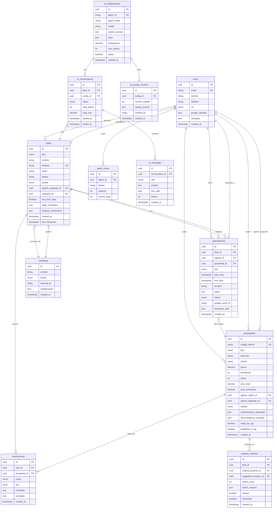

### 11.2 Definiciones SQL

```sql
-- USERS TABLE
CREATE TABLE users (
  id UUID PRIMARY KEY DEFAULT gen_random_uuid(),
  email TEXT UNIQUE NOT NULL,
  nombre TEXT NOT NULL,
  telefono TEXT,
  rol TEXT NOT NULL CHECK (rol IN ('admin', 'lead_manager', 'agente')),
  google_calendar JSONB, -- {calendar_id, refresh_token}
  metadata JSONB DEFAULT '{}'::jsonb,
  created_at TIMESTAMPTZ DEFAULT NOW()
);

-- CAMPAÑAS TABLE
CREATE TABLE campanas (
  id UUID PRIMARY KEY DEFAULT gen_random_uuid(),
  nombre TEXT NOT NULL,
  fuente TEXT NOT NULL CHECK (fuente IN ('facebook', 'instagram', 'google', 'tiktok', 'whatsapp_directo', 'referido', 'cuantovalemicasa')),
  external_id TEXT, -- ID de la campaña en la plataforma externa
  configuracion JSONB DEFAULT '{}'::jsonb,
  created_at TIMESTAMPTZ DEFAULT NOW()
);

-- LEADS TABLE
CREATE TABLE leads (
  id UUID PRIMARY KEY DEFAULT gen_random_uuid(),
  tipo TEXT NOT NULL CHECK (tipo IN ('reclutamiento', 'captacion', 'venta')),
  nombre TEXT NOT NULL,
  telefono TEXT UNIQUE NOT NULL,
  email TEXT,
  distrito TEXT,
  estado TEXT NOT NULL DEFAULT 'nuevo',
  agente_asignado_id UUID REFERENCES users(id),
  campana_id UUID REFERENCES campanas(id),
  has_form_data BOOLEAN DEFAULT false,
  datos_formulario JSONB,
  property_preferences JSONB, -- Para leads de venta
  created_at TIMESTAMPTZ DEFAULT NOW(),
  last_interaction TIMESTAMPTZ DEFAULT NOW(),

  CONSTRAINT valid_phone CHECK (telefono ~ '^\+?[0-9]{9,15}$')
);

CREATE INDEX idx_leads_tipo ON leads(tipo);
CREATE INDEX idx_leads_estado ON leads(estado);
CREATE INDEX idx_leads_agente ON leads(agente_asignado_id);
CREATE INDEX idx_leads_last_interaction ON leads(last_interaction);

-- PROPIEDADES TABLE
CREATE TABLE propiedades (
  id UUID PRIMARY KEY DEFAULT gen_random_uuid(),
  codigo_interno TEXT UNIQUE NOT NULL,
  tipo TEXT NOT NULL CHECK (tipo IN ('departamento', 'casa', 'terreno', 'oficina', 'local_comercial')),
  direccion TEXT NOT NULL,
  distrito TEXT NOT NULL,
  precio DECIMAL(12, 2) NOT NULL,
  dormitorios INT,
  banos INT,
  area_total DECIMAL(10, 2),
  area_construida DECIMAL(10, 2),
  agente_captor_id UUID REFERENCES users(id) NOT NULL,
  agente_asignado_id UUID REFERENCES users(id),
  estado TEXT NOT NULL DEFAULT 'prospecto' CHECK (estado IN ('prospecto', 'en_formalizacion', 'captada', 'en_venta', 'vendida', 'descartada')),
  caracteristicas_especiales JSONB DEFAULT '[]'::jsonb,
  documentacion_checklist JSONB,
  ready_for_sig BOOLEAN DEFAULT false,
  published_in_sig BOOLEAN DEFAULT false,
  created_at TIMESTAMPTZ DEFAULT NOW()
);

CREATE INDEX idx_propiedades_distrito ON propiedades(distrito);
CREATE INDEX idx_propiedades_estado ON propiedades(estado);
CREATE INDEX idx_propiedades_precio ON propiedades(precio);

-- INTERACCIONES TABLE
CREATE TABLE interacciones (
  id UUID PRIMARY KEY DEFAULT gen_random_uuid(),
  lead_id UUID REFERENCES leads(id) ON DELETE CASCADE,
  propiedad_id UUID REFERENCES propiedades(id),
  canal TEXT NOT NULL CHECK (canal IN ('whatsapp', 'email', 'llamada', 'reunion', 'sistema')),
  tipo TEXT NOT NULL,
  contenido TEXT,
  metadata JSONB DEFAULT '{}'::jsonb,
  created_at TIMESTAMPTZ DEFAULT NOW()
);

CREATE INDEX idx_interacciones_lead ON interacciones(lead_id);
CREATE INDEX idx_interacciones_created ON interacciones(created_at);

-- APPOINTMENTS TABLE
CREATE TABLE appointments (
  id UUID PRIMARY KEY DEFAULT gen_random_uuid(),
  lead_id UUID REFERENCES leads(id) NOT NULL,
  agente_id UUID REFERENCES users(id) NOT NULL,
  propiedad_id UUID REFERENCES propiedades(id),
  tipo TEXT NOT NULL CHECK (tipo IN ('visita_propiedad', 'entrevista_reclutamiento', 'reunion_seguimiento')),
  start_time TIMESTAMPTZ NOT NULL,
  end_time TIMESTAMPTZ NOT NULL,
  location TEXT,
  notes TEXT,
  status TEXT NOT NULL DEFAULT 'scheduled' CHECK (status IN ('scheduled', 'confirmed', 'completed', 'cancelled', 'no_show')),
  google_event_id TEXT,
  reminders_sent JSONB DEFAULT '[]'::jsonb,
  created_at TIMESTAMPTZ DEFAULT NOW()
);

CREATE INDEX idx_appointments_agente ON appointments(agente_id);
CREATE INDEX idx_appointments_start_time ON appointments(start_time);
CREATE INDEX idx_appointments_status ON appointments(status);

-- AGENT_ZONES TABLE
CREATE TABLE agent_zones (
  id UUID PRIMARY KEY DEFAULT gen_random_uuid(),
  agent_id UUID REFERENCES users(id) ON DELETE CASCADE,
  distrito TEXT NOT NULL,
  capacity INT NOT NULL DEFAULT 10,
  current_load INT NOT NULL DEFAULT 0,

  UNIQUE(agent_id, distrito)
);

-- AI_CONFIGURATIONS TABLE
CREATE TABLE ai_configurations (
  id UUID PRIMARY KEY DEFAULT gen_random_uuid(),
  agent_id TEXT UNIQUE NOT NULL, -- e.g., 'property_advisor_with_context'
  agent_name TEXT NOT NULL,
  model TEXT NOT NULL,
  system_prompt TEXT NOT NULL,
  tools JSONB DEFAULT '[]'::jsonb,
  temperature DECIMAL(3, 2) DEFAULT 0.7,
  max_tokens INT DEFAULT 2000,
  active BOOLEAN DEFAULT true,
  created_at TIMESTAMPTZ DEFAULT NOW()
);

-- AI_PROMPT_VERSIONS TABLE
CREATE TABLE ai_prompt_versions (
  id UUID PRIMARY KEY DEFAULT gen_random_uuid(),
  config_id UUID REFERENCES ai_configurations(id) ON DELETE CASCADE,
  version_number INT NOT NULL,
  system_prompt TEXT NOT NULL,
  created_by UUID REFERENCES users(id),
  created_at TIMESTAMPTZ DEFAULT NOW(),

  UNIQUE(config_id, version_number)
);

-- AI_CONVERSATIONS TABLE
CREATE TABLE ai_conversations (
  id UUID PRIMARY KEY DEFAULT gen_random_uuid(),
  lead_id UUID REFERENCES leads(id) ON DELETE CASCADE,
  config_id UUID REFERENCES ai_configurations(id),
  status TEXT DEFAULT 'active' CHECK (status IN ('active', 'completed', 'transferred_to_human')),
  total_tokens INT DEFAULT 0,
  total_cost DECIMAL(10, 4) DEFAULT 0,
  started_at TIMESTAMPTZ DEFAULT NOW(),
  ended_at TIMESTAMPTZ
);

CREATE INDEX idx_ai_conversations_lead ON ai_conversations(lead_id);

-- AI_MESSAGES TABLE
CREATE TABLE ai_messages (
  id UUID PRIMARY KEY DEFAULT gen_random_uuid(),
  conversation_id UUID REFERENCES ai_conversations(id) ON DELETE CASCADE,
  role TEXT NOT NULL CHECK (role IN ('system', 'user', 'assistant', 'tool')),
  content TEXT,
  tool_calls JSONB,
  tokens INT DEFAULT 0,
  created_at TIMESTAMPTZ DEFAULT NOW()
);

CREATE INDEX idx_ai_messages_conversation ON ai_messages(conversation_id);

-- PROPERTY_MATCHES TABLE
CREATE TABLE property_matches (
  id UUID PRIMARY KEY DEFAULT gen_random_uuid(),
  lead_id UUID REFERENCES leads(id) NOT NULL,
  original_property_id UUID REFERENCES propiedades(id),
  suggested_property_id UUID REFERENCES propiedades(id) NOT NULL,
  match_score INT NOT NULL,
  match_reasons JSONB DEFAULT '[]'::jsonb,
  viewed BOOLEAN DEFAULT false,
  interested BOOLEAN DEFAULT false,
  created_at TIMESTAMPTZ DEFAULT NOW()
);

CREATE INDEX idx_property_matches_lead ON property_matches(lead_id);
```

### 11.3 Row Level Security (RLS)

```sql
-- Habilitar RLS
ALTER TABLE leads ENABLE ROW LEVEL SECURITY;
ALTER TABLE propiedades ENABLE ROW LEVEL SECURITY;
ALTER TABLE appointments ENABLE ROW LEVEL SECURITY;

-- Políticas para LEADS
-- Admins y Lead Managers pueden ver todo
CREATE POLICY "Admins y Lead Managers ven todos los leads"
  ON leads FOR SELECT
  USING (
    EXISTS (
      SELECT 1 FROM users
      WHERE users.id = auth.uid()
      AND users.rol IN ('admin', 'lead_manager')
    )
  );

-- Agentes solo ven sus leads asignados
CREATE POLICY "Agentes ven sus leads"
  ON leads FOR SELECT
  USING (
    agente_asignado_id = auth.uid()
    OR
    EXISTS (
      SELECT 1 FROM users
      WHERE users.id = auth.uid()
      AND users.rol IN ('admin', 'lead_manager')
    )
  );

-- Similar para propiedades y appointments
```

---

## 12. PLAN DE IMPLEMENTACIÓN

### 12.1 Estructura del Proyecto

```
remax-iron-crm/
├── .env.local
├── .env.production
├── package.json
├── tsconfig.json
├── next.config.js
├── tailwind.config.ts
├── prisma/
│   ├── schema.prisma
│   └── migrations/
├── src/
│   ├── app/
│   │   ├── (auth)/
│   │   │   ├── layout.tsx
│   │   │   ├── dashboard/
│   │   │   ├── leads/
│   │   │   ├── propiedades/
│   │   │   ├── agentes/
│   │   │   ├── calendario/
│   │   │   ├── configuracion/
│   │   │   └── reportes/
│   │   ├── api/
│   │   │   ├── leads/
│   │   │   ├── propiedades/
│   │   │   ├── appointments/
│   │   │   ├── ai/
│   │   │   ├── webhooks/
│   │   │   └── integrations/
│   │   ├── login/
│   │   └── layout.tsx
│   ├── components/
│   │   ├── ui/              # shadcn components
│   │   ├── leads/
│   │   ├── propiedades/
│   │   ├── calendar/
│   │   ├── forms/
│   │   └── charts/
│   ├── lib/
│   │   ├── supabase/
│   │   │   ├── client.ts
│   │   │   └── server.ts
│   │   ├── ai/
│   │   │   ├── orchestrator.ts
│   │   │   ├── agents/
│   │   │   └── tools.ts
│   │   ├── whatsapp/
│   │   │   └── service.ts
│   │   ├── email/
│   │   │   └── service.ts
│   │   ├── calendar/
│   │   │   └── google.ts
│   │   └── utils.ts
│   └── types/
│       ├── leads.ts
│       ├── propiedades.ts
│       ├── ai.ts
│       └── index.ts
├── public/
└── docs/
    └── PRD.md (este archivo)
```

### 12.2 Fases de Desarrollo

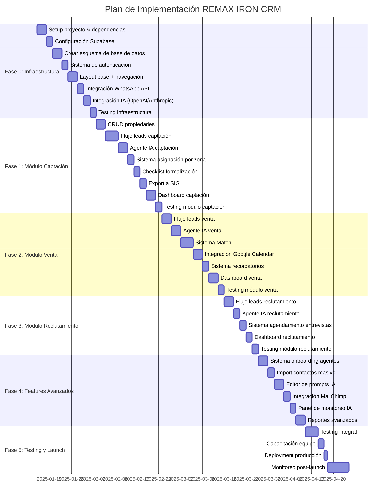

### 12.3 Timeline Resumido

| Fase | Duración | Entregables |
|------|----------|-------------|
| **Fase 0: Infraestructura** | 2-3 semanas | Base de datos, Auth, Integraciones base |
| **Fase 1: Módulo Captación** | 3 semanas | Flujo completo de captación funcionando |
| **Fase 2: Módulo Venta** | 3 semanas | Flujo de venta + Match + Calendario |
| **Fase 3: Módulo Reclutamiento** | 2 semanas | Flujo de reclutamiento completo |
| **Fase 4: Features Avanzados** | 2 semanas | Onboarding, Editor prompts, Reportes |
| **Fase 5: Testing y Launch** | 2 semanas | Sistema completo en producción |
| **TOTAL** | **14-16 semanas** | **Sistema completo operacional** |

### 12.4 Recursos Necesarios

**Equipo:**
- 1 Full Stack Developer (Javier o José)
- 1 Backend/AI Developer (José o Javier)
- [Opcional] 1 UI/UX Designer (primeras 4 semanas)

**Herramientas:**
- GitHub para código
- Figma para diseño (si hay diseñador)
- Linear o Jira para project management
- Slack para comunicación
- Vercel para deployment

**Costos Mensuales (Estimados):**
- Supabase Pro: $25/mes
- WhatsApp API (Como): $25/mes
- Hosting Vercel: $20/mes
- OpenAI API: $50-100/mes (varía según uso)
- Dominios y SSL: $15/mes
- **Total: ~$135-165/mes**

### 12.5 Criterios de Éxito

**KPIs Técnicos:**
- ✅ Uptime > 99.5%
- ✅ Tiempo de respuesta API < 200ms (p95)
- ✅ Tiempo de respuesta IA < 5 segundos
- ✅ 0 pérdidas de datos

**KPIs de Negocio:**
- ✅ 80%+ de leads calificados automáticamente sin intervención humana
- ✅ Reducción de 60% en tiempo de seguimiento manual
- ✅ 35 agentes usando el sistema activamente
- ✅ 100+ leads procesados/mes
- ✅ ROI positivo en 3 meses

---

## CONCLUSIÓN

Este PRD define un sistema completo que:

1. **Centraliza** todos los leads en una base de datos única
2. **Automatiza** el seguimiento y calificación con IA
3. **Mantiene UN SOLO número** de WhatsApp
4. **Permite configuración** de prompts y comportamiento de IA
5. **Actualiza en tiempo real** cuando entran leads
6. **Gestiona múltiples agentes** de forma inteligente
7. **Escala** con el crecimiento del negocio

**Próximos Pasos:**
1. Validar PRD con Diego
2. Definir alcance inicial (MVP vs. Completo)
3. Firmar contrato y comenzar Fase 0

---

**Preparado por:** Javier Cabrera y José Andonaire
**Fecha:** Noviembre 2025
**Versión:** 2.0
**Estado:** Listo para Aprobación e Implementación
